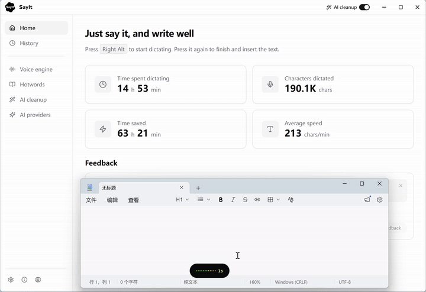
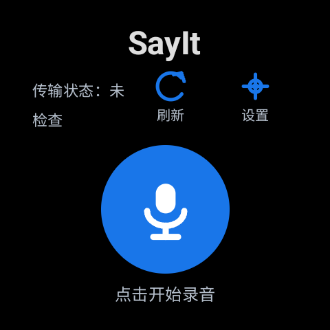
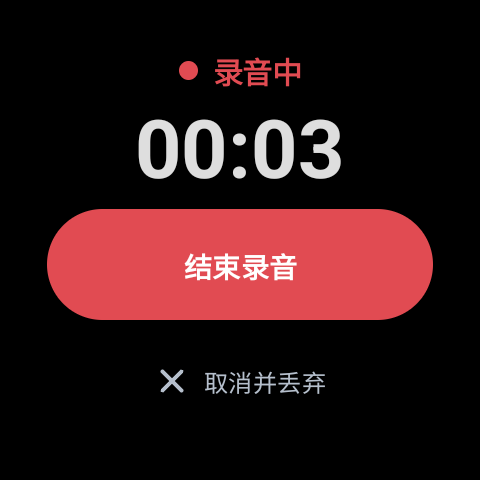
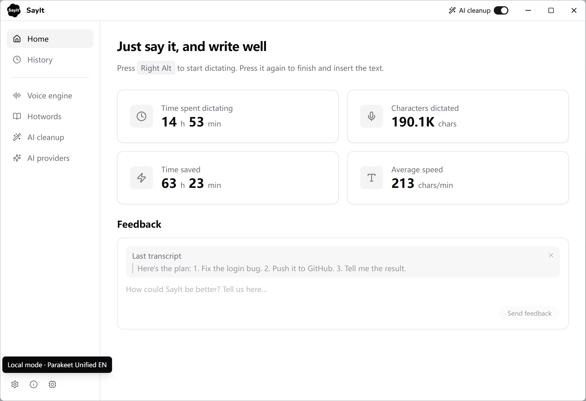
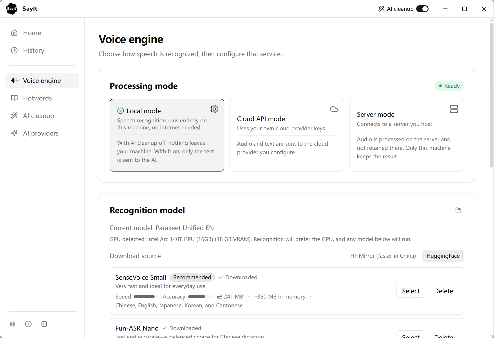
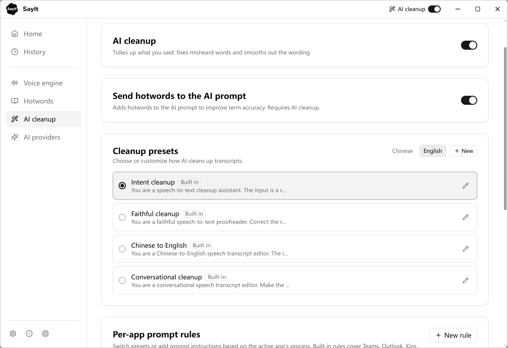
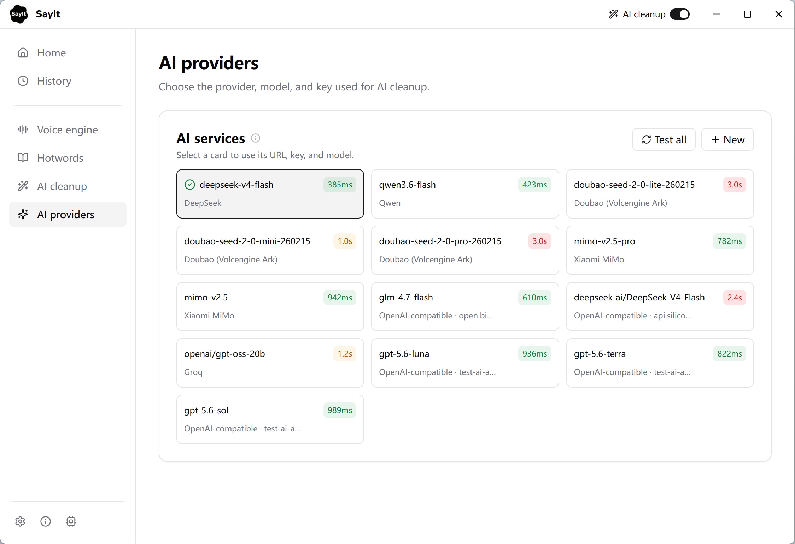
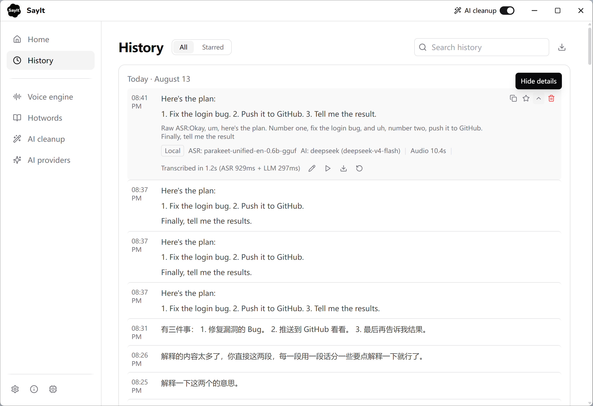
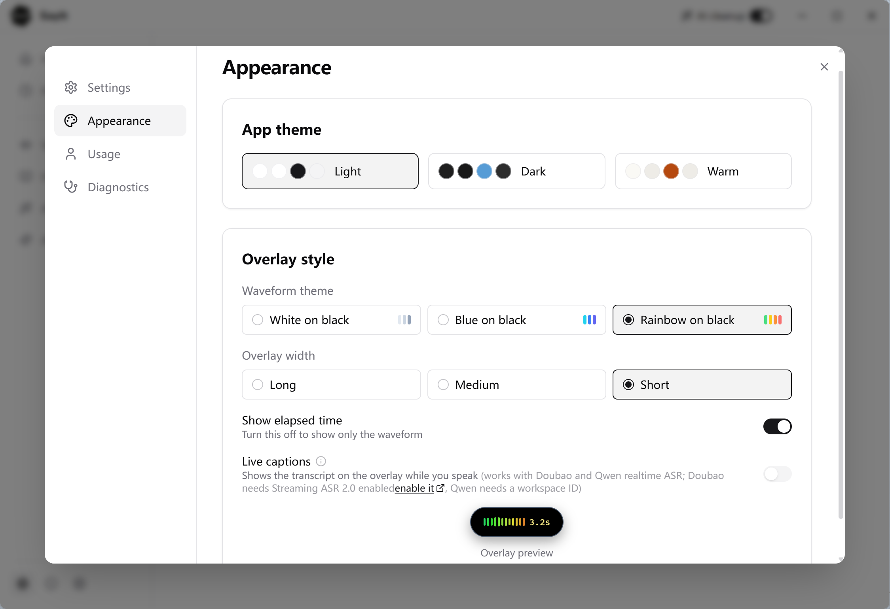

<div align="center">


# SayIt

**Just say it, and write well**

Open-source voice typing for Windows. Press a shortcut and speak—SayIt transcribes, cleans up, and inserts polished text wherever your cursor is.

[](./LICENSE)
[](https://github.com/crosswk/SayIt/releases/latest)
[](https://github.com/crosswk/SayIt/releases/latest)

**[Download for Windows](https://github.com/crosswk/SayIt/releases/latest)** · **[Try the web demo](https://sayitapp.site)** · **[简体中文](README.zh-CN.md)**

</div>

<div align="center">



*Trigger the shortcut, speak, and the cleaned-up text is typed in at your cursor — no window switching.*

</div>

## 我为什么折腾这个版本

先把话说清楚：**SayIt 不是我从零写的软件。**

它来自开源项目 [`crosswk/SayIt`](https://github.com/crosswk/SayIt)，使用
[AGPL-3.0](./LICENSE) 许可证。原项目的名字、主体功能、Windows 客户端、语音识别、
History、AI 整理和文字插入能力，都属于原项目及其贡献者。这个仓库只是我下载源码后做的
**本地自用分支**：保留上游归属，在它已经能用的基础上，补了一些本地安全修复和
Galaxy Watch 7 录音入口。

事情的起因其实很简单。

平时用 AI，最烦的往往不是“不会想”，而是要把脑子里的话一点点敲进输入框。电脑前不一定
总有顺手的麦克风，手机拿起来说又要切设备、复制、粘贴。跑着跑着，需求很容易越做越复杂：
配对、发现、Streaming、成功页、失败页、重试页……最后回头一看，我真正想要的只有一句话：

> **手表录一句话，通过 Wi-Fi 交给电脑上的 SayIt，然后文字出现在我已经点好的输入框里。**

所以这个版本现在刻意做得很克制：手表只负责开始录音、结束录音和把整段 WAV 发给电脑；
识别、History 和文字插入继续走 SayIt 原来的链路。手表不冒充电脑端告诉你“识别成功”——
输入框里出现文字，才是真的成功。没出现，就是没成功。别为了看起来功能多，再给自己增加
一堆没有必要的状态页面。

### 最简单的用法

如果你只需要普通的 Windows 语音输入，建议直接使用上游 SayIt：

1. 从 [`crosswk/SayIt Releases`](https://github.com/crosswk/SayIt/releases/latest) 下载并安装。
2. 在 SayIt 里选择本地或云端语音引擎；想保留原话，就关闭 AI 整理。
3. 先点击电脑上准备输入文字的位置。
4. 按 SayIt 的录音快捷键，说完结束，文字会插入当前输入框。

如果你想试这个仓库的 Galaxy Watch 7 入口：

1. Windows 端从源码启动这个 Debug 版本；Watch Receiver 只绑定你明确指定的局域网地址。
2. 让电脑和手表连接同一个可信 Wi-Fi，在手表 Config 中填写电脑 IP、端口和本机生成的
   Dev Token。不要把 Token 提交到 GitHub，也不要发给别人。
3. 配置有效后，手表平时直接进入 Ready；点设置时才回 Config。
4. 在电脑上先点好 ChatGPT、Codex、编辑器或其他目标输入框。
5. 点手表中央麦克风开始，说完点 Stop。手表静默上传并回到 Ready；最终只看电脑输入框
   是否出现完整文字。

实际链路就是：

`Galaxy Watch 7 → Wi-Fi → Windows SayIt → existing ASR → History → 当前输入框`

### Watch 上实际长什么样

下面不是效果图，是 Galaxy Watch 7 上真实运行的 dev.3 界面。

<div align="center">


&nbsp;&nbsp;


*左：Ready，点中央麦克风就开始。右：Recording，时间按真实采样数更新，说完点“结束录音”。*

</div>

我最后保留的就是这两个日常页面：Ready 和 Recording。Config 只在第一次配置、配置失效
或主动点设置时出现；正常使用不需要每次重新填地址。上传过程也不额外弹“成功/失败”页面，
因为 Watch 无法替电脑证明 ASR 和文字插入真的完成——最终还是看你刚才选中的输入框有没有字。

### 这个仓库适合谁

- 已经在 Windows 上使用 SayIt，又想把 Galaxy Watch 当成临时麦克风的人。
- 在意隐私，希望自己掌握局域网地址、模型和 Provider 配置的人。
- 能接受目前 Watch 部分仍是开发版，需要自己构建、安装和配置的人。

如果你只是想找一个装完就用的语音输入软件，请优先选择上游正式版。这个 Watch 分支目前不是
官方发行版，也不是公开互联网服务：没有正式配对、自动发现、后台持续录音或生产级 Release
传输。Debug 下的局域网 HTTP 只用于验证核心闭环，Release 默认不开放这条明文链路。

开发或接手前，请先阅读 [`HANDOFF.md`](HANDOFF.md) 和
[`PROJECT_PROGRESS.md`](PROJECT_PROGRESS.md)。这里记录的是这个本地分支真实做过什么、
什么已经验证、什么还只是实验；聊天里说“完成了”，不能代替源码、测试和真机证据。

## Why SayIt?

Typing is often the slowest part of working with AI. SayIt turns speech into text you can use immediately, while keeping the important choices in your hands:

- **Voice typing anywhere** — dictate into editors, chat apps, browsers, and other Windows software.
- **Editable AI cleanup** — remove filler words, repair recognition errors, format ideas, or keep a faithful transcript. Every prompt is yours to change.
- **Context-aware writing** (off by default) — reads the text around your cursor so new dictation matches its tone and terminology. Select text first and your speech becomes an editing instruction—translate, tighten, rewrite, or ask a question—replacing the selection directly. Password fields are skipped.
- **Flexible speech recognition** — use a cloud ASR provider, run a local GGUF model on your own GPU, connect to the public trial server, or host your own backend.
- **English and Chinese interface** — the UI follows your system language and can be switched at any time.
- **Hotwords and per-app rules** — improve names and technical terms, then change cleanup behavior automatically for different apps.
- **Overlay feedback** — a small waveform overlay shows recording state and elapsed time, with optional live captions while you speak.
- **Transparent data flow** — the app shows which mode is active and where audio and text are processed.
- **Local history and diagnostics** — review recordings, re-transcribe them, and collect useful troubleshooting details without guesswork.

## Choose how it runs

| Mode | Best for | Data flow |
| --- | --- | --- |
| **Local mode** | Privacy and offline use | Speech recognition stays on your PC. With AI cleanup off, nothing leaves the device. |
| **Cloud API mode** | The best balance for personal use | Your PC talks directly to the ASR and AI providers you configure. No SayIt server is involved. |
| **Server mode** | Teams and managed deployments | Audio is processed by a SayIt backend you control—or by the public trial server for a quick start. |

Local recognition ships seven GGUF models, with GPU acceleration when available: Parakeet Unified EN (fastest and most accurate for English), SenseVoice Small, Fun-ASR Nano, Nemotron 3.5 ASR (32 languages), and three Qwen3-ASR sizes. Cloud recognition supports Doubao, Qwen, Xiaomi MiMo, and Groq Whisper; AI cleanup works with DeepSeek, Qwen, Groq, MiMo, Ollama, and any OpenAI-compatible endpoint.

## A closer look

<div align="center">



*Home — dictation stats, the active shortcut, and a feedback box that carries your last transcript.*

<br>



*Voice engine — choose Local, Cloud API, or Server mode, then download and switch recognition models. Detected GPUs are used automatically.*

<br>



*AI cleanup — every built-in preset is editable, and per-app rules can switch presets based on the app you are typing into.*

<br>



*AI providers — bring your own keys, add any OpenAI-compatible endpoint, and test round-trip latency on every card.*

<br>



*History — searchable local records. Expand one to see the raw ASR text, timings, audio playback, and re-transcribe.*

<br>



*Appearance — three app themes, waveform styles, overlay width, and live captions with a preview of the overlay.*

</div>

## Get started

1. Download the latest [Windows installer](https://github.com/crosswk/SayIt/releases/latest).
2. Open SayIt and choose a voice engine. The default public server is enough for a quick trial.
3. Press the configured shortcut in any app and speak. By default you press once to start and again to finish; hold-to-talk is available too, under a separate shortcut.

For regular use, choose Local mode or add your own cloud provider keys from the in-app settings. The provider console links are available beside each key field.

## Self-hosting

The backend combines FastAPI, WebSocket streaming, Qwen3-ASR, and an optional OpenAI-compatible cleanup model. Docker Compose is the recommended deployment path.

```bash
git clone https://github.com/crosswk/SayIt.git
cd SayIt/server
cp config.example.yaml config.yaml
cp env.example .env
# Add your provider and deployment settings to .env/config.yaml
docker compose up -d --build
```

GPU speech recognition requires an NVIDIA GPU; 16 GB or more of VRAM is recommended for the default server model. See the [server guide](server/README.md) for configuration, deployment, security, and API details.

## Performance reference

Qwen3-ASR-1.7B with vLLM on an AWS EC2 `g5.xlarge` (NVIDIA A10G 24 GB):

| Audio length | ASR latency | RTF |
| --- | --- | --- |
| 30 seconds | ~0.8 s | 0.025 |
| 1 minute | ~1.6 s | 0.026 |
| 2 minutes | ~2.1 s | 0.017 |
| 3 minutes | ~2.5 s | 0.014 |
| 5 minutes | ~3.0 s | 0.010 |

## Development

### Desktop client

```bash
cd client
npm install
npm run tauri dev
```

Requirements: Node.js 18+, Rust 1.75+, CMake 3.20+, and the Vulkan SDK. The first native build compiles the C++ speech engine and may take around 20 minutes; later builds use the cache.

On non-English Windows installations, set `CL=/utf-8` before building so MSVC reads UTF-8 source files correctly.

### Server

```bash
cd server
python3 -m venv .venv
source .venv/bin/activate
pip install -r backend/requirements.txt
cd backend
uvicorn app.main:app --port 8000
```

Requirements: Python 3.10+ and, for GPU inference, an NVIDIA GPU with CUDA.

## Project layout

```text
SayIt/
├── client/       # Tauri + React desktop client
├── server/       # FastAPI backend, gateway, web demo, and deployment files
├── docs/         # User guides and images
└── dev-docs/     # Internal development notes
```

## Contributing

Bug reports, focused pull requests, and feature discussions are welcome. Please open a [GitHub issue](https://github.com/crosswk/SayIt/issues) or read the [contribution guide](CONTRIBUTING.md) before submitting a larger change.

## Contributors

<!-- ALL-CONTRIBUTORS-LIST:START -->
| [<br><sub>crosswk</sub>](https://github.com/crosswk) | [<br><sub>Claude (Anthropic)</sub>](https://claude.ai) |
|:---:|:---:|
<!-- ALL-CONTRIBUTORS-LIST:END -->

## License

[GNU Affero General Public License v3.0](./LICENSE)

You may use, modify, and self-host SayIt. If you distribute a modified version or run it as a network service, the corresponding source must remain available under the same license.
